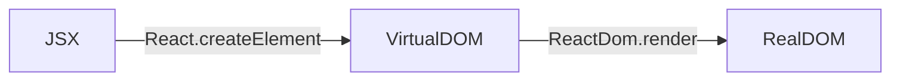

# 复习整理

<br/>

- [浏览器](#浏览器)
- [js](#js)
- [css](#css)
- [react](#react)
- [vue](#vue)
- [webpack](#webpack)
- [其他](#其他)
- [题目](#题目)
- [拓展链接](#拓展链接)

<br/><br/>

### 浏览器

#### 1. 缓存机制

> https://juejin.cn/post/6844903593275817998
>
> https://zhuanlan.zhihu.com/p/60950750

1. 强缓存：

   强缓存就是向浏览器缓存查找该请求结果，并根据该结果的缓存规则来决定是否使用该缓存结果的过程。不会向服务器发送请求，直接从缓存中读取资源。

   规则：当浏览器向服务器发起请求时，服务器会将缓存规则放入 HTTP 响应报文的 HTTP 头中和请求结果一起返回给浏览器，控制强制缓存的字段分别是 Expires 和 Cache-Control，其中 Cache-Control 优先级比 Expires 高。

2. 协商缓存：

   协商缓存就是强制缓存失效后，浏览器携带缓存标识向服务器发起请求，由服务器根据缓存标识（`Last-Modified`和`If-Modified-Since`、`ETag`和`If-None-Match`）决定是否使用缓存的过程。

   主要有两种情况： 304、 200

##### 拓展：

1. 禁止浏览器缓存的方法：

   方法 1. 后端设置 header 禁用缓存

   方法 2. 前端设置 HTML meta 标签禁用缓存

2. 为什么有`Expires`还要`Cache-Control`的存在？

   原因在于 Expires 控制缓存的原理是使用客户端的时间与服务端返回的时间做对比，那么如果客户端与服务端的时间因为某些原因（例如时区不同；客户端和服务端有一方的时间不准确）发生误差，那么强制缓存则会直接失效，这样的话强制缓存的存在则毫无意义

3. 为什么有`last-modified`还要`Etag`存在

   由于`last-modified`依赖的是保存的绝对时间，还是会出现误差的情况：

   - 保存的时间是以秒为单位的，1 秒内多次修改是无法捕捉到的；
   - 各机器读取到的时间不一致，就有出现误差的可能性。为了改善这个问题，提出了使用`Etag`。

#### 2. 从 URL 输入到页面展现到底发生什么？

> https://segmentfault.com/a/1190000017184701

1. URL 输入
2. DNS 解析：将域名解析成 IP 地址
3. TCP 连接：TCP 三次握手
4. 客户端发送 HTTP 请求
5. 服务器处理请求
6. 浏览器解析渲染页面
7. 断开连接：TCP 四次挥手

##### 拓展：

1. 浏览器解析渲染页面分为以下五个步骤：

  - 根据 HTML 解析出 DOM 树
  - 根据 CSS 解析生成 CSS 规则树
  - 结合 DOM 树和 CSS 规则树，生成渲染树
  - 根据渲染树计算每一个节点的信息
  - 根据计算好的信息绘制页面

2. **三次握手过程**：

   - 客户端发送标有 `SYN` 的数据包，表示我将要发送请求。
   - 服务端发送标有 `SYN/ACK` 的数据包，表示我已经收到通知，告知客户端发送请求。
   - 客户端发送标有 `ACK` 的数据包，表示我要开始发送请求，准备被接受。

3. **四次挥手过程**：

   - **第一次挥手：** 客户端发送一个`FIN`，用来关闭客户端到服务端的数据传送，客户端进入`FIN_WAIT_1`状态。
   - **第二次挥手：** 服务端收到`FIN`后，发送一个`ACK`给客户端，确认序号为收到序号+1（与- `SYN`相同，一个`FIN`占用一个序号），服务端进入`CLOSE_WAIT`状态。
   - **第三次挥手：** 服务端发送一个`FIN`，用来关闭服务端到客户端的数据传送，服务端进入`LAST_ACK`状态。
   - **第四次挥手：** 客户端收到`FIN`后，客户端进入`TIME_WAIT`状态，接着发送一个`ACK`给服务端，确认序号为收到序号+1，服务端进入`CLOSED`状态，完成四次挥手。

4. 为什么连接的时候是三次握手，关闭的时候却是四次挥手？

   答：因为当 Server 端收到 Client 端的 SYN 连接请求报文后，可以直接发送 SYN+ACK 报文。其中 ACK 报文是用来应答的，SYN 报文是用来同步的。但是关闭连接时，当 Server 端收到 FIN 报文时，很可能并不会立即关闭 SOCKET，所以只能先回复一个 ACK 报文，告诉 Client 端，"你发的 FIN 报文我收到了"。只有等到我 Server 端所有的报文都发送完了，我才能发送 FIN 报文，因此不能一起发送。故需要四次挥手。

5. 为什么需要三次握手？

   答：谢希仁著《计算机网络》中讲“三次握手”的目的是“**为了防止已失效的连接请求报文段突然又传送到了服务端，因而产生错误**”。

####3. 回流与重绘 (Reflow & Repaint)

> https://juejin.cn/post/6844903569087266823
>
> **回流必将引起重绘，重绘不一定会引起回流**

- 回流：某个元素的尺寸，位置发生了变化，则需重新计算渲染树，重新渲染
- 重绘：某个元素的背景颜色，文字颜色等，不影响元素周围或内部布局的属性，将只会引起浏览器的重绘

####4. 性能优化

1. 减少 HTTP 请求
2. 静态资源使用 CDN（CDN 就近原则，负载均衡）
3. 将 CSS 放在文件头部，JavaScript 文件放在底部
4. CSS Sprite（雪碧图）
5. 浏览器缓存（强缓存和协商缓存）
6. webpack 插件压缩文件
7. 图片优化
8. 减少回流重绘
9. 使用事件委托
10. 不要覆盖原生方法
11. 降低 CSS 选择器的复杂性
12. 减少 cookie 传输
13. nginx 开启 gzip
14. 开启 KeepAlive

#### 5. 性能监控

> https://juejin.cn/post/6955655898127663140
>
> https://juejin.cn/post/6844903662020460552

关于前端性能指标，W3C 定义了强大的 `Performance` API

#### 6. HTTP 状态码

> https://www.runoob.com/http/http-status-codes.html

**2XX 成功**

- 200 OK，表示从客户端发来的请求在服务器端被正确处理
- 204 No content，表示请求成功，但响应报文不含实体的主体部分
- 205 Reset Content，表示请求成功，但响应报文不含实体的主体部分，但是与 204 响应不同在于要求请求方重置内容
- 206 Partial Content，进行范围请求

**3XX 重定向**

- 301 moved permanently，永久性重定向，表示资源已被分配了新的 URL
- 302 found，临时性重定向，表示资源临时被分配了新的 URL
- 303 see other，表示资源存在着另一个 URL，应使用 GET 方法获取资源
- 304 not modified，表示服务器允许访问资源，但因发生请求未满足条件的情况
- 307 temporary redirect，临时重定向，和 302 含义类似，但是期望客户端保持请求方法不变向新的地址发出请求

**4XX 客户端错误**

- 400 bad request，请求报文存在语法错误
- 401 unauthorized，表示发送的请求需要有通过 HTTP 认证的认证信息
- 403 forbidden，表示对请求资源的访问被服务器拒绝
- 404 not found，表示在服务器上没有找到请求的资源

**5XX 服务器错误**

- 500 internal sever error，表示服务器端在执行请求时发生了错误
- 501 Not Implemented，表示服务器不支持当前请求所需要的某个功能
- 503 service unavailable，表明服务器暂时处于超负载或正在停机维护，无法处理请求

#### 7. 内存泄漏

> https://segmentfault.com/a/1190000020231307
>
> 系统进程不再用到的内存，没有及时释放，就叫做内存泄漏（memory leak）
>
> Node 环境下，可以用 Node 提供的 process.memoryUsage()方法来检查内存泄露

1. 意外的全局变量
2. 被遗忘的计时器
3. 被遗忘的事件监听器
4. 被遗忘的 ES6 Set 成员
5. 被遗忘的 ES6 Map 键名
6. 被遗忘的订阅发布事件监听器
7. 被遗忘的闭包
8. 脱离 DOM 的引用
9. console.log 打印的对象

##### 拓展：

1. 垃圾回收算法
   - 引用计数法
   - 标记清除法

#### 8. web 安全

> https://juejin.cn/post/6844903772930441230
>
> https://juejin.cn/post/6953059119561441287

1. XSS (Cross-Site Scripting)，跨站脚本攻击

   > 发送带有恶意脚本代码参数的 URL，innerHTML，document.write，From 表单，Input 输入脚本等等

   - 非持久型 XSS（反射型 XSS ）

     > 发送带有恶意脚本代码参数的 URL，诱骗点击

   - 持久型 XSS（存储型 XSS)

     > Form 表单提交等交互功能，如文章留言、评论、提交文本信息等，将内容经正常功能提交进入数据库持久保存，前端页面获得后端从数据库后渲染执行

2. CSRF (Cross-Site Request Forgery)，跨站请求伪造

   > 利用用户已登录的身份，在用户毫不知情的情况下，以用户的名义完成非法操作。
   >
   > 比如：当我们登入转账页面后，突然眼前一亮**惊现"XXX 隐私照片，不看后悔一辈子"的链接**，耐不住内心躁动，立马点击了该危险的网站，但当这页面一加载，便会执行自动提交的方法来提交转账请求，从而将 10 块转给黑客

3. 点击劫持

   > 用户在登陆 A 网站的系统后，被攻击者诱惑打开第三方网站，而第三方网站通过 iframe 引入了 A 网站的页面内容，用户在第三方网站中点击某个按钮（被装饰的按钮），实际上是点击了 A 网站的按钮。
   >
   > 比如：点的被装饰的按钮实际上是点到了 iframe 中的关注用户的按钮

4. URL 跳转漏洞

   > 恶意链接需要进行伪装，经常的做法是熟悉的链接后面加上一个恶意的网址。

##### 拓展：

1. SQL 注入
2. OS 命令注入攻击

#### 9. 前端常见跨域解决方案

产生的原因：浏览器同源策略，防止 XSS，CSRF 攻击的一个方式

> https://segmentfault.com/a/1190000011145364

1. 通过 jsonp 跨域
2. document.domain + iframe跨域
3. location.hash + iframe
4. window.name + iframe跨域
5. postMessage 跨域
6. 跨域资源共享（CORS）
7. nginx 代理跨域
8. nodejs 中间件代理跨域
9. WebSocket 协议跨域

<br/><br/>

### js

#### 1. EventLoop

> https://mp.weixin.qq.com/s/m3a6vjp8-c9a2EYj0cDMmg
>
> https://zhuanlan.zhihu.com/p/33058983
>
> - 宏任务（macro-task：task）：script(整体代码), setTimeout, setInterval, setImmediate, I/O, UI rendering。
> - 微任务（micro-task：jobs）：process.nextTick, Promise.resolve().then(), Object.observe(已废弃), MutationObserver(html5 新特性)
> - nextTick 队列会比 Promise 先执行
> - setTimeout 队列会比 setImmediate 的任务队列先执行，但在 I/O 事件的回调中，setImmediate 方法的回调永远在 timer 的回调前执行
>
> 事件循环的顺序，决定了 JavaScript 代码的执行顺序。它从 script(整体代码)开始第一次循环。之后全局上下文进入函数调用栈。直到调用栈清空(只剩全局)，然后执行所有的 micro-task。当所有可执行的 micro-task 执行完毕之后。循环再次从 macro-task 开始，找到其中一个任务队列执行完毕，然后再执行所有的 micro-task，这样一直循环下去。
>
> 事件顺序：script(整体代码 js 的主线程) —> 微任务 — > 宏任务 —> 微任务 — > 宏任务 —> … 循环...

##### 拓展

1. 为什么要有宏任务和微任务两种任务？

   > 页面渲染事件，各种 IO 的完成事件等随时被添加到任务队列中，一直会保持先进先出的原则执行，我们不能准确地控制这些事件被添加到任务队列中的位置。但是这个时候突然有高优先级的任务需要尽快执行，那么一种类型的任务就不合适了，所以引入了微任务队列。

2. node 中事件循环的顺序

   > https://juejin.cn/post/6844903761949753352
   >
   > 外部输入数据 --> 轮询阶段(poll) --> 检查阶段(check) --> 关闭事件回调阶段(close callback) --> 定时器检查阶段(timer) --> I/O 事件回调阶段(I/O callbacks) --> 闲置阶段(idle, prepare) --> 轮询阶段(反复运行)...
   >
   > - timers 阶段：这个阶段执行timer（setTimeout、setInterval）的回调
   > - I/O callbacks 阶段：处理一些上一轮循环中的少数未执行的 I/O 回调
   > - idle, prepare 阶段：仅node内部使用
   > - poll 阶段：获取新的I/O事件, 适当的条件下node将阻塞在这里
   > - check 阶段：执行 setImmediate() 的回调
   > - close callbacks 阶段：执行 socket 的 close 事件回调

### 2. 手写 call/apply/bind

> https://juejin.cn/post/6844903773979033614

```js
// call
Function.prototype.myCall = function (context) {
  context = context || window; // 如果没有传或传的值为空对象 context 指向 window
  const args = [...arguments].slice(1); // 处理参数 去除第一个参数 this 其它传入fn函数
  
  const fnSymbol = Symbol("fn"); // 确保方法唯一
  context[fnSymbol] = this; // 给 context 添加一个 fn 方法 指向this
  
  const result = context[fnSymbol](...args); // 执行fn
  delete context[fnSymbol]; // 删除方法
  return result;
};

const Person1 = {
  name: "测试",
  say() {
    console.log(this);
    console.log(`我叫${this.name}`);
  },
};
const Person2 = {
  name: "Person2",
};

Person1.say();
Person1.say.myCall(Person2);

// bind
Function.prototype.myBind = function (context) {
  if (typeof this !== "function") {
    throw new TypeError("Error: caller is not a function");
  }

  var _this = this;
  var args = [...arguments].slice(1);

  return function F() {
    if (this instanceof F) {
      return _this(...args, ...arguments);
    }
    return _this.apply(context, args.concat(...arguments));
  };
};
```

#### 3. 作用域链

当查找变量的时候，会先从当前执行上下文的变量对象中查找，如果没有找到，就会从父级(词法层面上的父级)执行上下文的变量对象中查找，一直找到全局上下文的变量对象，也就是全局对象。这样由多个执行上下文的变量对象构成的链表就叫做作用域链。

#### 4. 原型和原型链

> https://juejin.cn/post/6844903567375990791
>
> https://segmentfault.com/a/1190000005363885?utm_source=sf-similar-article
>
> JavaScript 中所有的对象都是由它的原型对象继承而来。而原型对象自身也是一个对象，它也有自己的原型对象，这样层层先向上，就形成了一个类似链表的结构，这就是**原型链（prototype chain）**
>
> 原型链的链头是 `Object.prototype.__proto__` 它的值比较特殊，值为null，而 null 则没有原型。
>
> 所有原型链的终点都是 Object 函数的 prototype 属性，因为在 JavaScript 中的对象都默认由 Object() 构造。Objec.prototype 指向的原型对象同样拥有原型，只不过它的原型是 null，而 null 则没有原型
>
> `实例对象.__proto__ === 构造函数.prototype`
>
> ```js
> function Person() {}
> 
> var person = new Person();
> 
> console.log(person.__proto__ === Person.prototype); // true
> console.log(Person.prototype.constructor === Person); // true
> // 顺便学习一个ES5的方法,可以获得对象的原型
> console.log(Object.getPrototypeOf(person) === Person.prototype); // true
> ```
>
> 访问对象的属性时，JavaScript 会首先在对象自身的属性内查找，若没有找到，则会跳转到该对象的原型对象中查找

拓展：

1. new 到底做了些什么？

   > https://juejin.cn/post/6844903582790057998
   >
   > 当使用`new`去调用构造函数 **Base** 时，相当于执行了
   >
   > ```javascript
   > var obj = {};
   > obj.__proto__ = Base.prototype;
   > var result = Base.call(obj);
   > return typeof result === 'object' ? result || obj : obj;
   > ```

2. constructor

   > 原型对象 prototype 上都有个预定义的`constructor`属性，用来引用它的函数对象。这是一种循环引用。
   >
   > ```javascript
   > function F() {}
   > F.prototype.constructor === F;
   > ```

#### 5. this

我们先来看几个函数调用的场景

```js
function foo() {
  console.log(this.a);
}
var a = 1;
foo();

const obj = {
  a: 2,
  foo: foo,
};
obj.foo();

const c = new foo();
```

- 对于直接调用 `foo` 来说，不管 `foo` 函数被放在了什么地方，`this` 一定是 `window`
- 对于 `obj.foo()` 来说，我们只需要记住，谁调用了函数，谁就是 `this`，所以在这个场景下 `foo` 函数中的 `this` 就是 `obj` 对象
- 对于 `new` 的方式来说，`this` 被永远绑定在了 `c` 上面，不会被任何方式改变 `this`
- 箭头函数中的 `this` 只取决包裹箭头函数的第一个普通函数的 `this`。
- `call/apply/bind`，`this` 取决于第一个参数
- 多次调用`bind`，`this` 永远由第一次 `bind` 决定

小结：

多个规则同时出现的情况：首先，`new` 的方式优先级最高，接下来是 `call/apply/bind` 这些函数，然后是 `obj.foo()` 这种调用方式，最后是 `foo` 这种调用方式，同时，箭头函数的 `this` 一旦被绑定，就不会再被任何方式所改变。

#### 6. 手写简易 promise

> [手写一个 Promise/A+,完美通过官方 872 个测试用例](https://segmentfault.com/a/1190000023157856)
>
> [手写 Promise](https://www.xyhthink.com/%E5%89%8D%E7%AB%AF%E9%9D%A2%E8%AF%95%E4%B9%8B%E9%81%93/6-%E6%89%8B%E5%86%99%20Promise.htm)

```js
var PENDING = "pending";
var RESOLVED = "resolved";
var REJECTED = "rejected";

function MyPromise(fn) {
  this.status = PENDING; // 初始状态为pending
  this.value = null; // 初始化value
  this.reason = null; // 初始化reason

  var that = this;

  function resolve(value) {
    if (that.status === PENDING) {
      that.status = RESOLVED;
      that.value = value;
    }
  }

  function reject(reason) {
    if (that.status === PENDING) {
      that.status = REJECTED;
      that.reason = reason;
    }
  }

  try {
    fn(resolve, reject);
  } catch (error) {
    reject(error);
  }
}

MyPromise.prototype.then = function (onFulfilled, onRejected) {
  var that = this;

  var realOnFulfilled = onFulfilled;
  // 如果 onFulfilled 不是函数，给一个默认函数，返回 value
  if (typeof onFulfilled !== "function") {
    realOnFulfilled = function (value) {
      return value;
    };
  }

  var realOnRejected = onRejected;
  // 如果 onRejected 不是函数，给一个默认函数，返回 reason 的 Error
  if (typeof onRejected !== "function") {
    realOnRejected = function (reason) {
      throw reason;
    };
  }

  if (that.status === RESOLVED) {
    onFulfilled(that.value);
  }

  if (that.status === REJECTED) {
    onRejected(that.reason);
  }
};

// 调用
new MyPromise((resolve, reject) => {
  // resolve("resolve 1");
  reject("reject 2");
}).then(
  (value) => {
    console.log("resolve...", value);
  },
  (reason) => {
    console.log("reject...", reason);
  }
);

// 等待态调用
new MyPromise((resolve, reject) => {
  setTimeout(() => {
    resolve(1);
    // reject(2);
  }, 0);
}).then(
  (value) => {
    console.log("resolve...", value);
  },
  (reason) => {
    console.log("reject...", reason);
  }
);
```

#### 7. 深浅拷贝

浅拷贝：Object.assign、展开运算符 `...`

深拷贝：JSON.parse(JSON.stringify(object))

手写深拷贝：

```js
// 简易版
function deepClone(obj) {
  function isObject(o) {
    return (typeof o === "object" || typeof o === "function") && o !== null;
  }

  if (!isObject(obj)) {
    throw new Error("非对象");
  }

  let isArray = Array.isArray(obj);
  let newObj = isArray ? [...obj] : { ...obj };
  Reflect.ownKeys(newObj).forEach((key) => {
    newObj[key] = isObject(obj[key]) ? deepClone(obj[key]) : obj[key];
  });

  return newObj;
}

// 实现2
function deepClone(obj) {
  //递归拷贝
  if (obj === null) return null; //null 的情况
  if (obj instanceof RegExp) return new RegExp(obj);
  if (obj instanceof Date) return new Date(obj);
  if (typeof obj !== "object") {
    //如果不是复杂数据类型，直接返回
    return obj;
  }
  /**
   * 如果obj是数组，那么 obj.constructor 是 [Function: Array]
   * 如果obj是对象，那么 obj.constructor 是 [Function: Object]
   */
  let t = new obj.constructor();
  for (let key in obj) {
    //如果 obj[key] 是复杂数据类型，递归
    t[key] = deepClone(obj[key]);
  }
  return t;
}
```

拓展：

1. JSON.parse(JSON.stringify(object)) 的缺点：
   - 如果obj里面有时间对象，则JSON.stringify后再JSON.parse的结果，时间将只是字符串的形式，而不是对象的形式
   - 如果obj里有RegExp(正则表达式的缩写)、Error对象，则序列化的结果将只得到空对象；
   - 如果obj里有函数，undefined，则序列化的结果会把函数或 undefined 丢失；
   - 如果obj里有NaN、Infinity和-Infinity，则序列化的结果会变成null

#### 8. 判断数据类型

> https://segmentfault.com/a/1190000018160547
>
> https://juejin.cn/post/6844903906258993165

typeof 可以判断表达式或者变量的类型，但是`typeof null`会返回`object`，

instanceof 运算符只能用于对象，不适用原始类型的值

**所以**用 typeof + Object.prototype.toString.call(xxx)

```js
function _typeof(val) {
  var ans = typeof val;
  if (ans === "object") {
    ans = Object.prototype.toString.call(val).slice(8, -1).toLowerCase();
  }
  return ans;
}
```

#### 9. 手写 New

> 原理：https://github.com/mqyqingfeng/Blog/issues/13

```js
function objectFactory() {
  	// 创建一个新的对象
    var obj = Object.create(null), 
    // 取得外部传入的构造器
    Constructor = [].shift.call(arguments);
    obj.__proto__ = Constructor.prototype;
  	// 借用外部传入的构造器给 obj 设置属性
    var ret = Constructor.apply(obj, arguments);
    // 确保构造器总是返回一个对象
    return typeof ret === 'object' ? ret || obj : obj;
};
```

#### 10. JS 继承

> https://github.com/mqyqingfeng/Blog/issues/16
> https://juejin.cn/post/6844903696111763470

1. 原型链继承

   - 核心：
     - Child.prototype = new Parent()

   - 优点：
     - 可继承构造函数的属性，父类构造函数的属性，父类原型的属性

   - 缺点：
     - 引用类型的属性被所有实例共享
     - 在创建 Child 的实例时，不能向Parent传参

2. 构造函数继承

   - 核心：
     - Parent.call(this)
   - 优点：
     - 避免了引用类型的属性被所有实例共享
     - 可以在 Child 中向 Parent 传参
   - 缺点：
     - 方法都在构造函数中定义，每次创建实例都会创建一遍方法。并且每次创建的都是一个新的方法
     - 只能继承父类的**实例**属性和方法，不能继承**原型**属性/方法
     - 实例并不是父类的实例，只是子类的实例

3. 组合继承

   - 核心：

     ```js
     Parent.call(this, name); 
     Child.prototype = new Parent(); 
     Child.prototype.constructor = Child;
     ```

   - 优点：

     - 结合了原型链继承和构造函数继承的优点

   - 缺点：

     - 父类构造函数被调用两次,子类实例的属性存在两份。造成内存浪费

4. 原型式继承

   - 核心：

     ```js
     // 类似`Object.create`
     function createObj(o) 
     		function F(){};
         F.prototype = o;
         return new F();
     }
     ```

   - 优点：

   - 缺点：

     - （同原型链继承）
     - 包含引用类型的属性值始终都会共享相应的值，这点跟原型链继承一样
     - 无法传递参数

5. 寄生式继承

   - 核心：

     ```js
     function createObj (o) {
     	var clone = Object.create(o);
       clone.sayName = function () {
         console.log('hi');
       }
       return clone;
     }
     ```

   - 优点：

     - 可添加新的属性和方法

   - 缺点：

     - （同构造函数继承）
     - 跟构造函数模式一样，每次创建对象都会创建一遍方法。
     - 无法传递参数

6. 寄生组合式继承

   - 核心：

     ```js
     function Parent (name) {
         this.name = name;
         this.colors = ['red', 'blue', 'green'];
     }
     
     Parent.prototype.getName = function () {
         console.log(this.name)
     }
     
     function Child (name, age) {
         Parent.call(this, name);
         this.age = age;
     }
     
     // 关键的三步
     var F = function () {};
     
     F.prototype = Parent.prototype;
     
     Child.prototype = new F();
     
     
     var child1 = new Child('kevin', '18');
     
     console.log(child1);
     ```

   - 优点：

     - **最成熟**

   - 缺点：

7. ES6 Class  extends

   - 核心：
     - 原理类似于寄生组合式继承方式
   - 优点：
     - 新的语法糖
   - 缺点：

拓展：

1. ES5继承和ES6继承的区别？

   - ES5的继承实质上是先创建子类的实例对象，然后再将父类的方法添加到 this 上（Parent.call(this)）.
   - ES6的继承有所不同，实质上是先创建父类的实例对象this，然后再用子类的构造函数修改this。因为子类没有自己的this对象，所以必须先调用父类的super()方法，否则新建实例报错。

   

   

#### 11. 函数柯里化

> https://github.com/mqyqingfeng/Blog/issues/42
>
> 柯里化是将一个多参数函数转换成多个单参数函数，也就是将一个 n 元函数转换成 n 个一元函数。
>
> 理解柯里化的实现 ：用闭包把参数保存起来，当参数的数量足够执行函数了，就开始执行函数。

```js
// segmentfault 的@大笑平 补充的高颜值写法：

var curry = fn =>
    judge = (...args) =>
        args.length === fn.length
            ? fn(...args)
            : (...arg) => judge(...args, ...arg)
```


#### 12. 实现一个`instanceOf`

```js
function instanceOf(left,right) {
    let proto = left.__proto__;
    let prototype = right.prototype
    while(true) {
        if(proto === null) return false
        if(proto === prototype) return true
        proto = proto.__proto__;
    }
}
```


#### 13. DOM 事件

DOM事件级别

1. DOM0：element.onclick = funciton(){}
2. DOM2：element.addEventListener('click', function(){}, false)
3. DOM3：element.addEventListener('keyup', fucntion(){})

事件模型

事件流

1. 冒泡到父级：目标元素 — dom结构父级 — body — html — document — window
2. 捕获到子级：window — document — html — body — dom结构父级 — 目标元素

自定义事件

```js
var event = new Event('custom'); // 事件构造器，CustomEvent 可以携带参数
elem.addEventLinstener('custom', function(){}); // 监听
elem.dispatchEvent(event); // 触发
```


<br/><br/>

### css

#### 1. css 盒模型

 	1. 标准模型
 	2. IE 模型

#### 2. link和@import的区别

 1. 从属关系区别

    `@import`是 CSS 提供的语法规则，只有导入样式表的作用；`link`是HTML提供的标签，不仅可以加载 CSS 文件，还可以定义 RSS、rel 连接属性等。

 2. 加载顺序区别

    加载页面时，`link`标签引入的 CSS 被同时加载；`@import`引入的 CSS 将在页面加载完毕后被加载。

 3. 兼容性区别

    `@import`是 CSS2.1 才有的语法，故只可在 IE5+ 才能识别；`link`标签作为 HTML 元素，不存在兼容性问题。

 4. DOM可控性区别

    可以通过 JS 操作 DOM ，插入`link`标签来改变样式；由于DOM方法是基于文档的，无法使用`@import`的方式插入样式。

 5. 权重区别

    `link`引入的样式权重大于`@import`引入的样式。

#### 3. 什么是 BFC

> https://zhuanlan.zhihu.com/p/25321647

#### 


<br/><br/>

### react

> [「2021」高频前端面试题汇总之React篇（上）](https://juejin.cn/post/6941546135827775525)
>
> [「2021」高频前端面试题汇总之React篇（下）](https://juejin.cn/post/6940942549305524238)

#### 1. diff 算法

> https://zhuanlan.zhihu.com/p/20346379
>
> https://zhuanlan.zhihu.com/p/140489744

React 在比较新旧 2 棵虚拟 DOM 树的时候，会同时考虑两点：

- 尽量少的创建 / 删除节点，多使用移动节点的方式
- 比较次数要尽量少，算法要足够的快

如果只考虑第一点，算法的时间复杂度要达到 O(n^3)的级别（^3 指 3 次方）。也就是说对于一个有 1000 个节点的树，要进行 10 亿次的比较，这对于前端应用来说是完全不可接受的。因此，React 选用了启发式的算法，将时间复杂度控制在 O(n) 的级别。这个算法基于以下 2 个假设：

- 如果 2 个节点的类型不一样，以这 2 个节点为根结点的树会完全不同
- 对于多次 render 中结构保持不变的节点，开发者会用一个 key 属性标识出来，以便重用

Diff 使用的是广度优先算法

1.传统 diff 算法

计算两颗树形结构差异的最优解一直是一个复杂且值得研究的问题，传统的 diff 算法，需要遍历整棵树的节点然后进行比较，是一个深度递归的过程，运算复杂度常常是`O(n^3)`，这样的低效率在 react 中肯定是不能容忍的，那么 react 对于 diff 算法进行了哪些优化呢？

2.react diff 的优化策略

- DOM 节点跨层级的操作不做优化，因为很少这么做，这是针对的 tree 层级的策略；
- 对于同一个类的组件，会生成相似的树形结构，对于不同类的组件，生成不同的树形结构，这是针对 component 层级的策略；
- 对于同一级的子节点，拥有同层唯一的 key 值，来做删除、插入、移动的操作，这是针对 element 层级的策略；

#### 2. Hooks 依赖

> React 使用 `Object.is` 比较算法来比较 deps。

#### 3. fiber 架构，解决了什么问题？

`React16`将**递归的无法中断的更新**重构为**异步的可中断更新**

fiber架构解决渲染问题。js的运行机制是单线程，当某个组件非常庞大的情况，js执行会占用较多的时间，导致渲染页面响应缓慢，用户体验很差。

#### 4. React 中 setState 什么时候是同步的，什么时候是异步的？

> https://github.com/Advanced-Frontend/Daily-Interview-Question/issues/17

在React中，**如果是由React引发的事件处理（比如通过onClick引发的事件处理），调用setState不会同步更新this.state，除此之外的setState调用会同步执行this.state** 。所谓“除此之外”，指的是绕过React通过addEventListener直接添加的事件处理函数，还有通过setTimeout/setInterval产生的异步调用。

**原因：** 在React的setState函数实现中，会根据一个变量isBatchingUpdates判断是直接更新this.state还是放到队列中回头再说，而isBatchingUpdates默认是false，也就表示setState会同步更新this.state，但是，**有一个函数batchedUpdates，这个函数会把isBatchingUpdates修改为true，而当React在调用事件处理函数之前就会调用这个batchedUpdates，造成的后果，就是由React控制的事件处理过程setState不会同步更新this.state**。

**注意：** setState的“异步”并不是说内部由异步代码实现，其实本身执行的过程和代码都是同步的，只是合成事件和钩子函数的调用顺序在更新之前，导致在合成事件和钩子函数中没法立马拿到更新后的值，形式了所谓的“异步”，当然可以通过第二个参数 setState(partialState, callback) 中的callback拿到更新后的结果。

#### 5. Hooks 解决什么问题？

**解决函数组件没有state、生命周期、逻辑不能复用的一种技术方案**

它可以让你在不编写 class 的情况下使用 state 以及其他的 React 特性。

除了减少对 class 、生命周期 理解的难度，**重点是更好的组件之间复用状态逻辑**。不用重复在多个生命周期中使用的相同逻辑（如：componentDidMount、componentDidUpdate）。

也有缺点：

1. 响应式的 useEffect
2. hooks 不擅长异步的代码（旧引用问题）
3. custom hooks 有时严重依赖参数的不可变性

#### 6. react Hook之useMemo、useCallback及memo

> https://juejin.cn/post/6844903954539626510

在子组件不需要父组件的值和函数的情况下，只需要使用memo函数包裹子组件即可。而在使用函数的情况，需要考虑有没有函数传递给子组件使用useCallback。而在值有所依赖的项，并且是对象和数组等值的时候而使用useMemo（当返回的是原始数据类型如字符串、数字、布尔值，就不要使用useMemo了）。不要盲目使用这些hooks。

#### 7. 什么是 react 合成事件？

> 浏览器原生事件的跨浏览器包装器

##### 三个目的：

1. 进行浏览器兼容，实现更好的跨平台
2. 避免垃圾回收
3. 方便事件统一管理和事务机制

##### 结论

1. `React` 组件绑定事件是合成事件，本质上是代理到 `document` 上，采用事件冒泡的形式冒泡到 `document` 上面，然后 `React` 将事件封装给正式的函数处理运行和处理（可以理解成`React`所有事件都是绑定在`document`层）
2. 对于 `React` 的合成事件对象 `e`，`e.stopPropagation()`只能阻止`React`合成事件的冒泡，`e.nativeEvent.stopImmediatePropagation`只能用来阻止冒泡到直接绑定在`document`上的事件
3. 要想阻止所有的冒泡事件，只能通过`ref`获得`dom`节点监听，用原生事件对象`e`的`e.stopPropagation()`去阻止冒泡

##### react 中事件的执行顺序：

​	原生事件 —> react 合成事件 —> document 事件

##### 为什么要自己实现一套事件机制

> https://segmentfault.com/a/1190000039108951

由于fiber机制的特点，生成一个fiber节点时，它对应的dom节点有可能还未挂载，onClick这样的事件处理函数作为fiber节点的prop，也就不能直接被绑定到真实的DOM节点上。所以它就绑定在 document 上（React17的事件是注册到root上而非document），利用事件捕获执行从触发的组件向父组件回溯，然后调用他们 JSX 中定义的 callback。

#### 

#### 8. 为什么不能在判断中写钩子函数

- React 通过单链表来管理 Hooks
- 按 Hooks 的执行顺序依次将 Hook 节点添加到链表中

如果打乱顺序，那么没法正确的从 Hooks 链表中获取信息。当然 React 也会给我们报错。

拓展

1. ##### Hooks链表放在哪？

   组件构建的 Hooks 链表会挂载到 FiberNode 节点的 memoizedState 上面

   

#### 9. react17 的改动

> 没有新特性
>
> React 17版本不同寻常，因为它没有添加任何面向开发人员的**新功能**。取而代之的是，该发行版主要致力于简化React本身的升级。

1. 更改事件委托
2. 新的JSX转换
3. 对标浏览器
   1. `onScroll` 事件**不再冒泡**
   2. React 的 `onFocus` 和 `onBlur` 事件已在底层切换为原生的 `focusin` 和 `focusout` 事件。
   3. 捕获事件（例如，`onClickCapture`）现在使用的是实际浏览器中的捕获监听器。
4. 去除事件池
5. 副作用清理时间
6. 返回一致的 undefined 错误
7. 原生组件栈
8. 移除私有导出


#### 10. react 生命周期

> https://zh-hans.reactjs.org/docs/react-component.html

[传送门](<https://projects.wojtekmaj.pl/react-lifecycle-methods-diagram/>)

##### （记忆 4 + 5 + 1）

##### Mounting

- constructor
- **(static)** getDerivedStateFromProps
- render
- componentDidMount

##### Updating

- **(static)** getDeriverStateFromProps
- shouldComponentUpdate
- render
- getSnapshotBeforeUpdate
- componentDidUpdate

##### Unmounting

- componentWillUnmount

##### 错误处理

- **(static)**  getDerivedStateFromError
- componentDidCatch


#### 11. react 代码复用的几种方式

1. Mixin
2. HOC
3. render props 
4. react hook （v16.8+）


#### 12. jsx 是什么？

jsx 是一种语法糖，经过 babel 编译为 React.createElement() 的形式，其返回结果就是 Virtual DOM，最后通过 ReactDOM.render() 将 Virtual DOM 转化为真实的 DOM 渲染在界面上。

流程如下：



#### 

<br/><br/>

### vue

#### 1. vue3 为什么使用 Proxy 替换 defineProperty？

- Object.defineProperty

  1. `Object.defineProperty`无法监控到数组下标的变化，导致直接通过数组的下标给数组设置值，不能实时响应。经过 vue 内部处理后可以使用以下几种方法来监听数组`push()`、`pop()`、`shift()`、`unshift()`、`splice()`、`sort()`、`reverse()`，由于只针对了以上几种方法进行了`hack`处理,所以其他数组的属性也是检测不到的，还是具有一定的局限性。
  2. `Object.defineProperty`只能劫持对象的属性,因此我们需要对每个对象的每个属性进行遍历。

- Proxy

  1. 可以劫持整个对象，并返回一个新对象。
  2. 有 `13` 种劫持操作。

##### 对比

- `Proxy` 作为新标准将受到浏览器厂商重点持续的性能优化
- `Proxy` 能观察的类型比 `defineProperty` 更丰富
- `Proxy` 不兼容 IE，也没有 `polyfill`, `defineProperty` 能支持到 IE9
- `Object.definedProperty` 是劫持对象的属性，新增元素需要再次 `definedProperty`。而 `Proxy` 劫持的是整个对象，不需要做特殊处理
- 使用 `defineProperty` 时，我们修改原来的 `obj` 对象就可以触发拦截，而使用 `proxy`，就必须修改代理对象，即 `Proxy` 的实例才可以触发拦截

#### Vue 和 React 之间的区别

Vue 的表单可以使用 `v-model` 支持双向绑定，相比于 React 来说开发上更加方便，当然了 `v-model` 其实就是个语法糖，本质上和 React 写表单的方式没什么区别。

改变数据方式不同，Vue 修改状态相比来说要简单许多，React 需要使用 `setState` 来改变状态，并且使用这个 API 也有一些坑点。并且 Vue 的底层使用了依赖追踪，页面更新渲染已经是最优的了，但是 React 还是需要用户手动去优化这方面的问题。

React 16 以后，有些钩子函数会执行多次，这是因为引入 Fiber 的原因，这在后续的章节中会讲到。

React 需要使用 JSX，有一定的上手成本，并且需要一整套的工具链支持，但是完全可以通过 JS 来控制页面，更加的灵活。Vue 使用了模板语法，相比于 JSX 来说没有那么灵活，但是完全可以脱离工具链，通过直接编写 `render` 函数就能在浏览器中运行。

在生态上来说，两者其实没多大的差距，当然 React 的用户是远远高于 Vue 的。

在上手成本上来说，Vue 一开始的定位就是尽可能的降低前端开发的门槛，然而 React 更多的是去改变用户去接受它的概念和思想，相较于 Vue 来说上手成本略高。

<br/><br/>


### webpack

> https://juejin.cn/post/6844904094281236487
>
> https://juejin.cn/post/6844903781847695367

1. ##### Webpack构建流程

   - 初始化：启动构建，读取与合并配置参数，加载 Plugin，实例化 Compiler
   - 编译：从 Entry 出发，针对每个 Module 串行调用对应的 Loader 去翻译文件的内容，再找到该 Module 依赖的 Module，递归地进行编译处理
   - 输出：将编译后的 Module 组合成 Chunk，将 Chunk 转换成文件，输出到文件系统中

2. ##### Webpack 性能优化

> https://www.xyhthink.com/%E5%89%8D%E7%AB%AF%E9%9D%A2%E8%AF%95%E4%B9%8B%E9%81%93/17-Webpack%20%E6%80%A7%E8%83%BD%E4%BC%98%E5%8C%96.htm
>
> https://juejin.cn/post/6844903994045775880
>
> https://juejin.cn/post/6844903784305393677

1. ##### 减少 Webpack 打包时间

   - 优化 Loader
   - HappyPack
   - DllPlugin
   - 代码压缩

2. ##### 减少 Webpack 打包后的文件体积

   - 按需加载
   - Scope Hoisting
   - Tree Shaking

<br/><br/>

### 其他

#### 1. js 为什么是单线程?

javascript 从诞生之日起就是一门单线程的非阻塞的脚本语言。这是由其最初的用途来决定的：与浏览器交互。

单线程是必要的，也是 javascript 这门语言的基石，原因之一在其最初也是最主要的执行环境——浏览器中，我们需要进行各种各样的 dom 操作。试想一下 如果 javascript 是多线程的，那么当两个线程同时对 dom 进行一项操作，例如一个向其添加事件，而另一个删除了这个 dom，此时该如何处理呢？因此，为了保证不会发生类似于这个例子中的情景，javascript 选择只用一个主线程来执行代码，这样就保证了程序执行的一致性。

web worker 技术号称让 javascript 成为一门多线程语言，但有着诸多限制。

#### 2. 

#### 3. UDP 与 TCP 的区别

> https://zhuanlan.zhihu.com/p/24860273

> 1. UDP：User Datagram Protocol，用户数据报协议
> 2. TCP：Transmission Control Protocol，传输控制协议

|              | UDP                                         | TCP                                    |
| :----------- | :------------------------------------------ | :------------------------------------- |
| 是否连接     | 无连接                                      | 面向连接                               |
| 是否可靠     | 不可靠传输，不使用流量控制和拥塞控制        | 可靠传输，使用流量控制和拥塞控制       |
| 连接对象个数 | 支持一对一，一对多，多对一和多对多交互通信  | 只能是一对一通信                       |
| 传输方式     | 面向报文                                    | 面向字节流                             |
| 首部开销     | 首部开销小，仅 8 字节                       | 首部最小 20 字节，最大 60 字节         |
| 适用场景     | 适用于实时应用（IP 电话、视频会议、直播等） | 适用于要求可靠传输的应用，例如文件传输 |

#### 4. 微信小程序双线程模型

小程序的**渲染层**和**逻辑层**分别由两个线程管理：

- 渲染层的界面使用 WebView 进行渲染
- 逻辑层采用 JSCore 运行 JavaScript 代码

#### 5. Nginx proxy_pass 规则

1. `proxy_pass` 只是 host，后面没有任何 URL 路径信息，如：http://127.0.0.1、http://example.cn。则反向代理的地址会包含 `location` 中的匹配部分
2. `proxy_pass` 有 URL 路径信息，比如：http://127.0.0.1/、http://127.0.0.1/v1、http://127.0.0.1/v1/。反向代理的地址不会包含 `location` 部分，且 `location` 部分会被 `proxy_pass` URL 路径部分替换掉。

#### 6. TS

1. 静态类型检查，类型定义

2. 面向接口编程

3. 增强了编辑器和 IDE 的功能，包括代码补全、接口提示、跳转到定义、重构等

4. 类

   - public：公共修饰符

     > 表示属性或方法都是公有的，在类的内部，子类的内部，类的实例都能被访问,默认情况下，为public 

   - private：私有修饰符

     > 表示在当前类中可以访问。子类，外部类不可以访问

   - protected：保护类型

     > 表示在当前类中和子类中可以访问，外部类不可以访问

   - abstract：抽象类

     > 不允许被实例化，只能用于被子类继承


<br/><br/>

### 题目

#### 1. 实现add(3)(4)和add(3,4)都输出7，请实现add方法

> https://segmentfault.com/q/1010000004342477

```js
function add(){
	let args = [...arguments];
  
	let fn = function(){
		args.push(...arguments);
		return fn;
	}
  
	fn.toString = function(){
		return args.reduce((a,b)=> a + b);
	}
  
	return fn;
}
```

#### 2. 手写 ES6 与 ES5 继承，说说区别

> https://juejin.cn/post/6844903924015120397
>
> ES6 与 ES5 中的继承有 2 个区别，
>
> - 第一个是，ES6 中子类会继承父类的属性，
> - 第二个区别是，super() 与 A.call(this) 是不同的，在继承原生构造函数的情况下，体现得很明显，ES6 中的子类实例可以继承原生构造函数实例的内部属性，而在 ES5 中做不到。

```js
// ES5
function A() {
  this.a = 'hello';
}

function B() {
  A.call(this);
  this.b = 'world';
}

B.prototype = Object.create(A.prototype, {
  constructor: { 
    value: B, 
    writable: true, 
    configurable: true 
  }
});

let b = new B();

// ES6
class A {
  constructor() {
    this.a = 'hello';
  }
}

class B extends A {
  constructor() {
    super();
    this.b = 'world';
  }
}

let b = new B();
```


<br/><br/>

### 拓展链接

- [80% 应聘者都不及格的 JS 面试题](https://juejin.cn/post/6844903470466629640)
- [详解 JavaScript 中的 Event Loop（事件循环）机制](https://zhuanlan.zhihu.com/p/33058983)
- https://github.com/WindrunnerMax/EveryDay
- js深入系列：https://github.com/mqyqingfeng/Blog
- [前端面试之道](https://www.xyhthink.com/%E5%89%8D%E7%AB%AF%E9%9D%A2%E8%AF%95%E4%B9%8B%E9%81%93/1-%E5%B0%8F%E5%86%8C%E9%A3%9F%E7%94%A8%E6%8C%87%E5%8D%97.htm)
- [2021年我的前端面试准备](https://juejin.cn/post/6989422484722286600)
- [字节跳动最爱考的前端面试题：JavaScript 基础](https://juejin.cn/post/6934500357091360781)
- [「2021」高频前端面试题汇总之React篇（上）](https://juejin.cn/post/6941546135827775525)
- [「2021」高频前端面试题汇总之React篇（下）](https://juejin.cn/post/6940942549305524238)
- https://lgwebdream.github.io/FE-Interview/
- React源码分析：https://react.iamkasong.com/
- ts工具类型分析：https://github.com/piotrwitek/utility-types
